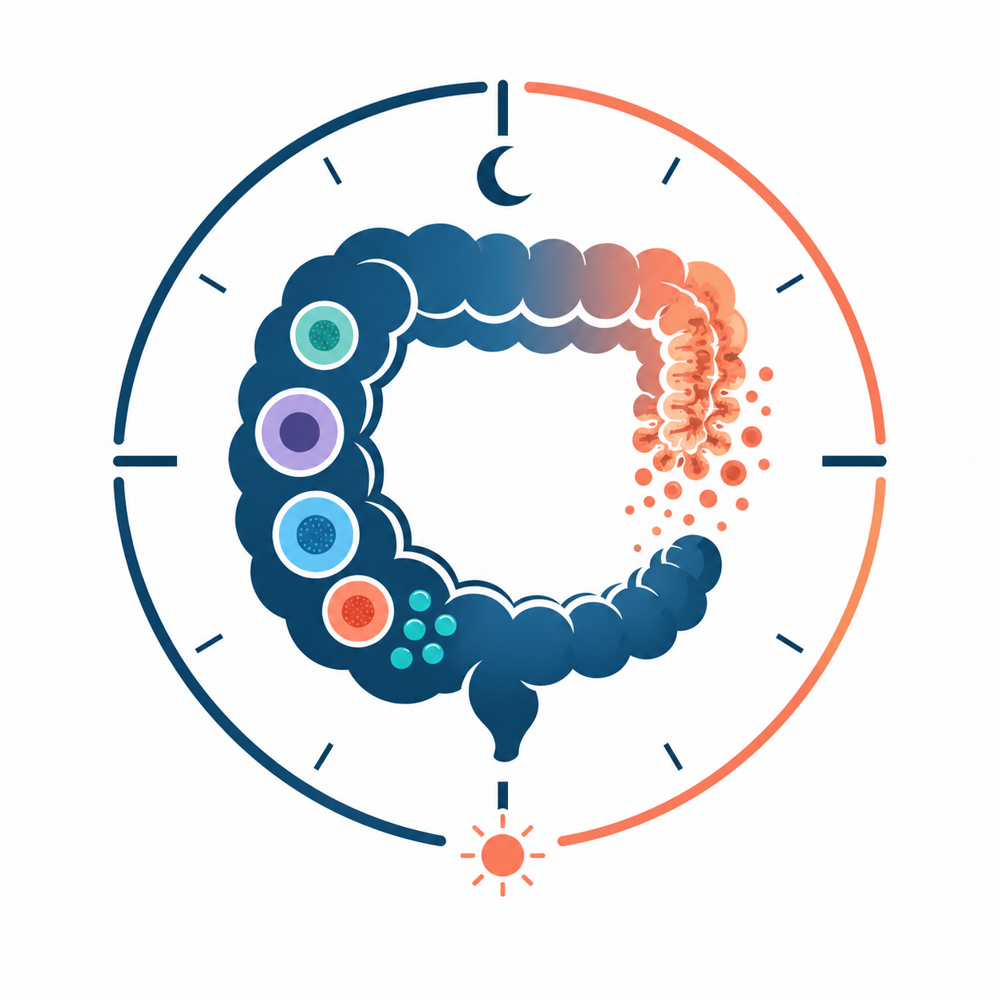

# Chrono-atlas of cell-type specific daily gene expression rhythms in the undamaged and regenerating mouse colon

<p align="center">
  
</p>

## Overview

This repository contains the analysis code accompanying the manuscript
*Chrono-atlas of cell-type specific daily gene expression rhythms in the regenerating colon* (Carmona-Alcocer, Gobet et al.), bioRxiv [10.1101/2025.11.20.689502](https://doi.org/10.1101/2025.11.20.689502).

The study uses single-cell RNA-seq to profile 24-hour gene expression rhythms across >20 cell types of the mouse colon in undamaged and DSS-induced regenerating conditions, in the proximal and distal regions.

## Data availability

| Resource | Accession / DOI | Description |
|----------|----------------|-------------|
| ENA | [PRJEB102541](https://www.ebi.ac.uk/ena/browser/view/PRJEB102541) | Raw sequencing reads (FASTQ) |
| Zenodo | [10.5281/zenodo.20048987](https://doi.org/10.5281/zenodo.20048987) | Cell Ranger raw `.h5`, CellBender-corrected `.h5`, final annotated `.rds` |

## Repository structure

```
colon-chrono-atlas/
├── code/
│   ├── Run_CellBender.sh   # Ambient RNA removal (SLURM array)
│   ├── Doublet_finder.R    # Per-sample doublet detection + merge
│   ├── Analysis_1.R        # QC, RPCA integration, clustering, annotation
│   └── Analysis_2.R        # Pseudobulk, harmonic regression, cSVD, figures
├── data/                   # Inputs and intermediate objects (see below)
└── plot/                   # Generated figures
```

## Reproducing the analysis

All R scripts resolve the repo root from the `REPO_DIR` environment variable, then `here::here()`, then `getwd()`. The simplest setup is to launch R from the repo root, or set `REPO_DIR` explicitly:

```bash
export REPO_DIR=/path/to/colon-chrono-atlas
```

There are three entry points depending on how much you want to recompute. Pick one and download the corresponding archive from Zenodo into `data/`.

### Entry point A — start from raw Cell Ranger `.h5` (full pipeline)

1. Download `raw_h5.tar.gz` from Zenodo, extract into `data/raw_h5/`.
2. Install [CellBender](https://github.com/broadinstitute/CellBender) (CUDA-capable GPU recommended) and make `cellbender` callable from your shell. The provided script assumes a conda environment named `cellbender`; adjust the `conda activate` line in `code/Run_CellBender.sh` if your install differs. Then run the SLURM array (24 jobs):
   ```bash
   sbatch code/Run_CellBender.sh
   ```
   Outputs land in `data/cellbender/<sample>_cellbender/`.
3. Continue with entry point B from step 2.

### Entry point B — start from CellBender-corrected `.h5`

1. Download `cellbender_h5.tar.gz` from Zenodo, extract into `data/cellbender/` (the scripts handle both flat and per-sample-folder layouts).
2. Run DoubletFinder + merge:
   ```r
   source("code/Doublet_finder.R")
   ```
   Produces `data/dat_big_filtered_cellbender_doubletfinder.rds`.
3. Run preprocessing, integration, clustering, and annotation:
   ```r
   source("code/Analysis_1.R")
   ```
   Produces `data/data_integrated_celltype_cellbender_df.rds`.
4. Continue with entry point C from step 2.

### Entry point C — start from the annotated Seurat object

1. Download `data_integrated_celltype_cellbender_df.rds` from Zenodo into `data/`.
2. Run the rhythmicity analysis and figure generation:
   ```r
   source("code/Analysis_2.R")
   ```
   Produces `data/Table_S1.xlsx` (rhythmic gene table) and figures in `plot/`.

## Software requirements

- **Cell Ranger** v7.0.1 (`multi`, 10x Flex)
- **CellBender** (see [install instructions](https://github.com/broadinstitute/CellBender), CUDA-capable GPU recommended)
- **R** (≥ 4.3) with: `Seurat` (v4.1.3), `DoubletFinder`, `DropletUtils`, `presto`, `edgeR`, `enrichR`, `patchwork`, `ggplot2`, `ggtext`, `ggrepel`, `ggstance`, `dplyr`, `tidyr`, `reshape2`, `parallel`, `openxlsx`, `colorspace`, `here`

## Key parameters

- **QC**: 300–15,000 UMIs, 300–5,000 genes, < 7.5% mito.
- **Integration**: RPCA on 3,000 HVGs, Leiden at 0.3, 30 PCs.
- **Doublet rate**: 4% with pK optimized per sample, homotypic adjustment.
- **Rhythmicity**: pseudobulk per `sex × cond × celltype × ZT`, edgeR TMM + log2 CPM, harmonic regression at 24 h, BH correction. Thresholds: p < 0.05 and log2 amplitude > 0.5.
- **Cell-type filter**: `k_rem` excludes cell types with < 800 cells globally or any timepoint with < 20 cells per condition (22 of 29 retained).
